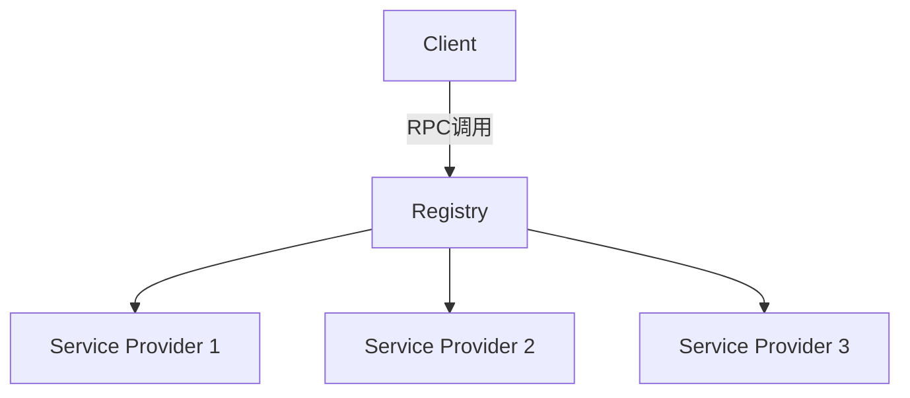

# RPC系统架构设计

## 1. 系统概述
本项目是一个基于Java的RPC(远程过程调用)框架，提供以下核心功能：
- 服务注册与发现
- 远程方法调用
- 负载均衡
- 容错机制

## 2. 架构图

## 3. 核心组件
- **客户端(Client)**: 发起RPC调用
- **注册中心(Registry)**: 服务注册与发现
- **服务提供者(Service Provider)**: 实现并暴露服务
- **负载均衡器(Load Balancer)**: 分配请求
- **序列化组件(Serializer)**: 数据格式转换

## 4. 技术选型
- 通信协议: TCP/HTTP
- 序列化: JSON/Protobuf
- 服务发现: ZooKeeper
- 负载均衡: 随机/轮询/一致性哈希

## 5. 设计决策
- 采用接口代理模式实现透明调用
- 使用Netty作为底层通信框架
- 支持同步和异步调用模式
- 提供熔断和降级机制