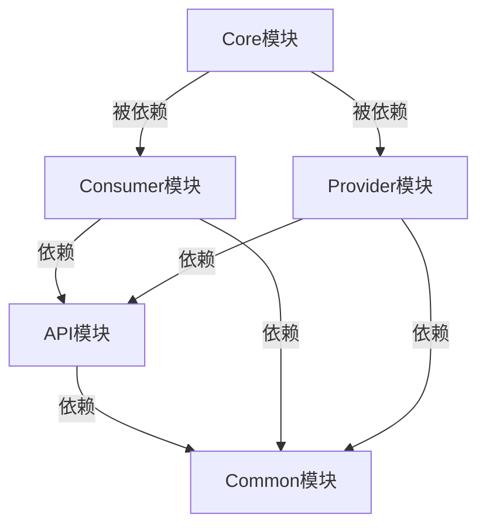

# RPC-Java 项目功能实现方案总览

## 1. 项目架构

## 2. 模块职责

| 模块名称 | 主要职责 | 关键组件 |
|---------|---------|---------|
| api | 定义服务接口和DTO | 服务接口、DTO对象 |
| common | 提供公共组件 | 序列化、协议、SPI |
| core | RPC核心实现 | 注册中心、负载均衡 |
| consumer | 服务消费者 | 动态代理、容错 |
| provider | 服务提供者 | 服务暴露、线程池 |

## 3. 核心流程

### 3.1 服务注册流程
1. Provider启动
2. 注册服务到Zookeeper
3. 维持心跳连接

### 3.2 服务调用流程
1. Consumer生成代理
2. 发现服务实例
3. 负载均衡选择实例
4. 发起RPC调用
5. Provider处理请求
6. 返回调用结果

## 4. 相关文档
- [Core模块](modules/core.md)
- [Common模块](modules/common.md) 
- [API模块](modules/api.md)
- [Consumer模块](modules/consumer.md)
- [Provider模块](modules/provider.md)